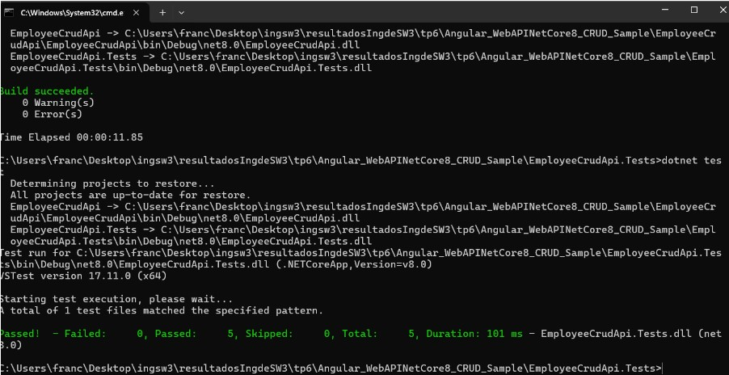

4.1 Creación de una BD SQL Server para nuestra App

4.2 Obtener nuestra App
A. Clonar el repo https://github.com/ingsoft3ucc/Angular_WebAPINetCore8_CRUD_Sample.git
B. Seguir las instrucciones del README.md del repo clonado prestando atención a la modificación de la cadena de conexión en el appSettings.json para que apunte a la BD creada en 4.1
C. Navegar a http://localhost:7150/swagger/index.html y probar uno de los controladores para verificar el correcto funcionamiento de la API.

4.3 Crear Pruebas Unitarias para nuestra API
A. En el directorio raiz de nuestro repo crear un nuevo proyecto de pruebas unitarias para nuestra API

B. Instalar dependencias necesarias

D. Renombrar archivo UnitTest1.cs por EmployeeControllerUnitTests.cs

E. Editar el archivo EmployeeCrudApi.Tests/EmployeeCrudApi.Tests.csproj para agregar una referencia a nuestro proyecto de EmployeeCrudApi reemplazando su contenido por

G. Verificar que se hayan ejecutado correctamente las pruebas

H. Verificar que no estamos usando una dependencia externa como la base de datos.

I. Modificar la cadena de conexión en el archivo appsettings.json para que use un usuario o password incorrecto y recompilar el proyecto EmployeeCrudApi

K. En la carpeta de nuestro proyecto EmployeeCrudApi.Tests volver a correr las pruebas
L. Verificar que se hayan ejecutado correctamente las pruebas inclusive sin tener acceso a la BD, lo que confirma que es efectivamente un conjunto de pruebas unitarias que no requieren de una dependencia externa para funcionar.

M. Modificar la cadena de conexión en el archivo appsettings.json para que use el usuario y password correcto y recompilar el proyecto EmployeeCrudApi

N. Verificar que nuestro proyecto vuelve a tener acceso a la BD navegando a http://localhost:7150/swagger/index.html y probando uno de los controladores:

4.4 Creamos pruebas unitarias para nuestro front de Angular:
A. Nos posicionamos en nuestro proyecto de front, en el directorio EmployeeCrudAngular/src/app

B. Editamos el archivo app.component.spec.ts reemplazando su contenido por:

C. Creamos el archivo employee.service.spec.ts reemplazando su contenido por:

D. Editamos el archivo employee.component.spec.ts ubicado en la carpeta employee reemplazando su contenido por:

E. Editamos el archivo addemployee.component.spec.ts ubicado en la carpeta addemployee reemplazando su contenido por:

F. En el directorio raiz de nuestro proyecto EmployeeCrudAngular ejecutamos el comando

H. Vemos que los tests se ejecutaron correctamente:

I. Verificamos que no esté corriendo nuestra API navegando a http://localhost:7150/swagger/index.html y recibiendo esta salida:

4.5 Agregamos generación de reporte XML de nuestras pruebas de front.
Haremos los siguientes pasos para prepararnos:
A. Instalamos dependencia karma-junit-reporter

B. En el directorio raiz de nuestro proyecto (al mismo nivel que el archivo angular.json) creamos un archivo karma.conf.js con el siguiente contenido

C. Ejecutamos nuestros test de la siguiente manera:
ng test --karma-config=karma.conf.js --watch=false --browsers ChromeHeadless

4.6 Modificamos el código de nuestra API y creamos nuevas pruebas unitarias:

B. Crear las pruebas unitarias necesarias para validar las modificaciones realizadas en el código

