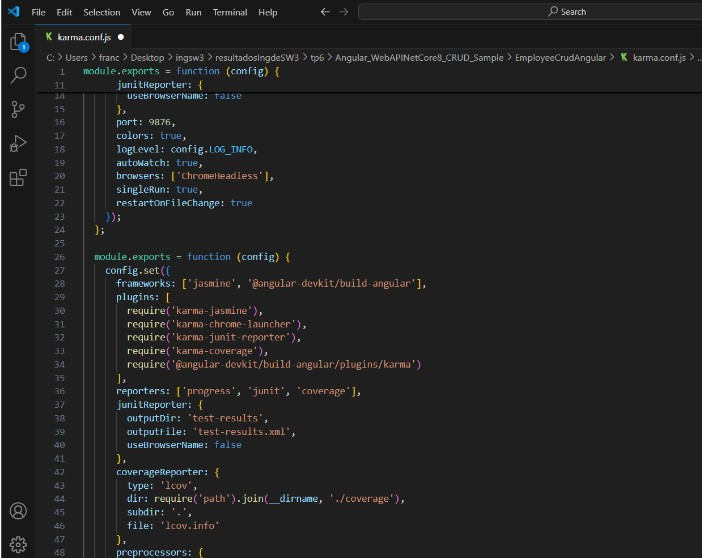
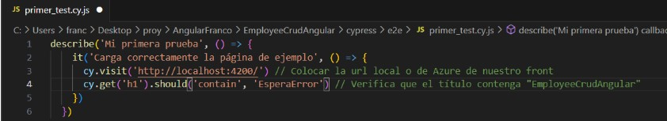
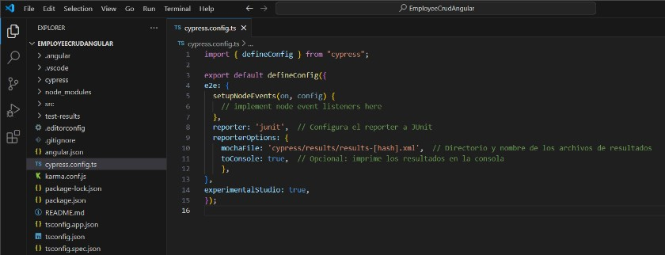
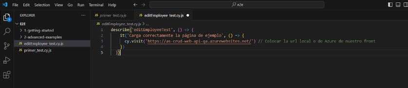

4- Desarrollo:
Prerequisitos:
4.1 Agregar Code Coverage a nuestras pruebas unitarias de backend y front-end e integrarlas junto con sus resultados en nuestro pipeline de build.
Desarrollo del punto 4.1:
4.1.1 En el directorio raiz de nuestro proyecto Angular instalar el siguiente paquete:

4.1.2 Editar nuestro archivo karma.conf.js para que incluya reporte de cobertura

4.1.3 En el dir raiz del proyecto EmployeeCrudApi.Tests ejecutar:
dotnet add package coverlet.collector

4.1.4 Agregar a nuestro pipeline ANTES del Build de Back la tarea de test con los argumentos especificados y la de publicación de resultados de cobertura:

4.1.5 Agregar a nuestro pipeline ANTES del Build de front la tarea de test y la de publicación de los resultados.

4.1.6 Ejecutar el pipeline y analizar el resultado de las pruebas unitarias y la cobertura de código.

4.2 Agregar Análisis Estático de Código con SonarCloud:

4.2.1 Integraremos SonarCloud para analizar el código fuente. Configurar SonarCloud en nuestro pipeline siguiendo instructivo 5.1

4.2.2 Vemos el resultado de nuestro pipeline, en extensions tenemos un link al análisis realizado por SonarCloud

4.2.3 Ir al link y analizar toda la información obtenida. Detallar en la entrega del TP los puntos más relevantes del informe, qué significan y para qué sirven.

Se han identificado diversos problemas relacionados con mantenibilidad, consistencia, fiabilidad y seguridad. A continuación, se detallan los puntos más importantes:
Método sin acceso a datos de instancia (EmployeeControllerUnitTests.cs):
Problema: El método GetInMemoryDbContext no utiliza datos de instancia y debería marcarse como static.
Importancia: Mejorar la claridad del código y reducir el uso de recursos, favoreciendo una mejor lectura y evitando confusión.
Optimización de expresiones regulares (EmployeeController.cs):
Problema: Se recomienda usar GeneratedRegexAttribute para generar expresiones regulares en tiempo de compilación en lugar de en tiempo de ejecución.
Importancia: Mejora el rendimiento de la aplicación al reducir la sobrecarga en tiempo de ejecución.
Propiedades en controladores no adecuadamente configuradas (Employee.cs):
Problema: Las propiedades de tipo valor usadas en controladores deben ser nullable, obligatorias o anotadas con JsonRequiredAttribute.
Importancia: Prevenir errores de validación y mejorar la fiabilidad de las solicitudes HTTP en la API, evitando el "under-posting".
Uso incorrecto de programación asíncrona (Program.cs):
Problema: Falta de uso del await en el método RunAsync.
Importancia: Garantizar que las operaciones asíncronas se completen correctamente, evitando comportamientos inesperados.
Vulnerabilidad crítica en credenciales (appsettings.json):
Problema: Se expone una contraseña de base de datos en el archivo de configuración.
Importancia: Esta es una vulnerabilidad de seguridad grave. Se recomienda eliminar la contraseña del código y gestionarla mediante un sistema de secretos seguro para evitar accesos no autorizados.
Además, el análisis nos indica que tardaremos aproximadamente 45 minutos en arreglar esos issues.

4.3 Pruebas de Integración con Cypress:
4.3.1 En el directorio raiz de nuestro proyecto Angular instalar el siguiente paquete:

4.3.2 Abrir Cypress:

4.3.3 Inicializar Cypress en nuestro proyecto como se indica en el instructivo 5.2
Esto creará automáticamente una estructura de carpetas dentro de tu proyecto.

cypress/e2e: Aquí es donde se almacenan tus archivos de prueba.
cypress/fixtures: Aquí se almacenan los datos de prueba que puedes usar en tus tests.
cypress/support: Contiene archivos de configuración y comandos personalizados.

4.3.4 Crear nuestra primera prueba navegando a nuestro front.

En la carpeta cypress/e2e, crear un archivo con el nombre primer_test.js y agregar el siguiente código para probar la página de inicio de nuestro front:

4.3.5 Correr nuestra primera prueba
Si está abierta la interfaz gráfica de Cypress, aparecerá el archivo primer_test.cy.js en la lista de pruebas. Clic en el archivo para ejecutar la prueba.

También es posible ejecutar Cypress en modo "headless" (sin interfaz gráfica) utilizando el siguiente comando:
npx cypress run

4.3.6 Modificar nuestra prueba para que falle.
Editamos el archivo primer_test.cy.js y hacemos que espere otra cosa en el título
Ejecutamos cypress en modo headless

Cypress captura automáticamente pantallas cuando una prueba falla. Las capturas de pantalla se guardan en la carpeta

4.3.6 Grabar nuestras pruebas para que Cypress genere código automático y genere reportes:
Editamos el archivo cypress.config.ts incluyendo la propiedad experimentalStudio en true y la configuración de reportería

Corremos nuevamente Cypress con npx cypress open, una vez que se ejecute nuestra prueba tendremos la opción de "Add Commands to Test". Esto permitirá interactuar con la aplicación y generar automáticamente comandos de prueba basados en las interacciones con la página:

Por ejemplo, si agregamos un nuevo empleado y luego verificamos que esté en la lista, Cypress nos generará un código como este:

Por supuesto que habrá que hacerle ajustes, como por ejemplo que se fije siempre en la última fila de la grilla y no en la posición 15 como lo grabó, es ahí cuando consultando la documentación de Cypress debemos ver cómo modificar el código, en nuestro caso de ejemplo sería así:

4.3.7 Hacemos prueba de editar un empleado
Creamos en cypress/e2e/ un archivo editEmployee_test.cy.js con el siguiente contenido, guardamos y aparecerá en Cypress:

-hacemos “Add command to the test" y empezamos a interactuar con la página

