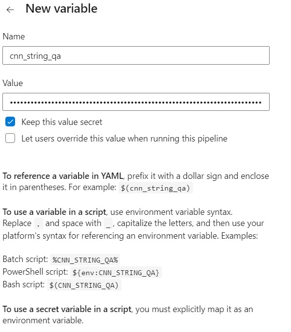
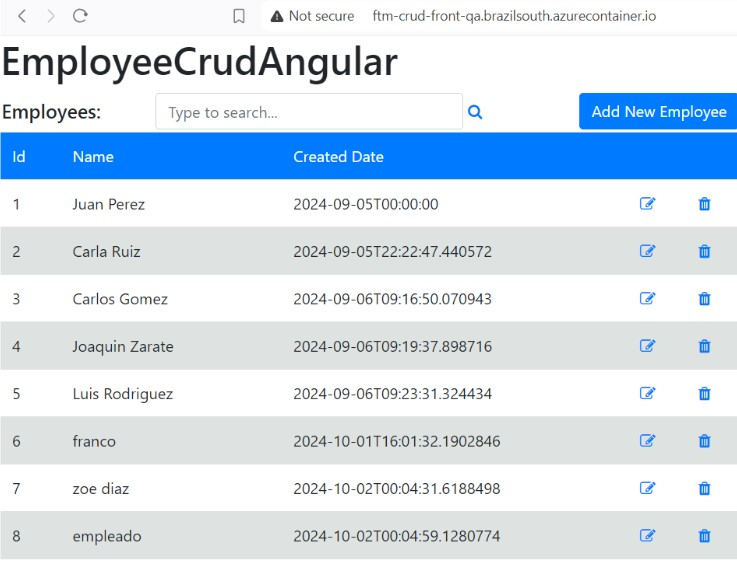
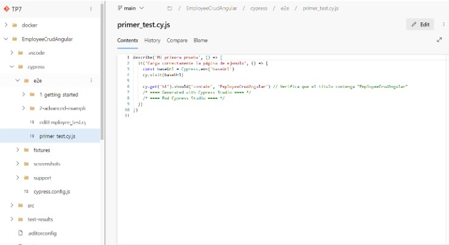

4- Desarrollo:
Prerequisitos:
Azure CLI instalado

4.1 Modificar nuestro pipeline para construir imágenes Docker de back y front y subirlas a ACR
Desarrollo del punto 4.1:
4.1.1 Crear archivos DockerFile para nuestros proyectos de Back y Front
En la raiz de nuestro repo crear una carpeta docker con dos subcarpetas api y front, dentro de cada una de ellas colocar los dockerfiles correspondientes para la creación de imágenes docker en función de la salida de nuestra etapa de Build y Test

Crear un recurso ACR en Azure Portal

4.1.3 Modificar nuestro pipeline en la etapa de Build y Test
Luego de la tarea de publicación de los artefactos de Back agregar la tarea de publicación de nuestro dockerfile de back para que esté disponible en etapas posteriores:
Luego de la tarea de publicación de los artefactos de Front agregar la tarea de publicación de nuestro dockerfile de front para que esté disponible en etapas posteriores:

4.1.4 En caso de no contar en nuestro proyecto con una ServiceConnection a Azure Portal para el manejo de recursos, agregar una service connection a Azure Resource Manager como se indica en instructivo 5.2

4.1.5 Agregar a nuestro pipeline variables

4.1.6 Agregar a nuestro pipeline una nueva etapa que dependa de nuestra etapa de Build y Test
Agregar tareas para generar imagen Docker de Back

4.1.7 - Ejecutar el pipeline y en Azure Portal acceder a la opción Repositorios de nuestro recurso Azure Container Registry. Verificar que exista una imagen con el nombre especificado en la variable backImageName asignada en nuestro pipeline

4.1.8 - Agregar tareas para generar imagen Docker de Front (DESAFIO)
A la etapa creada en 4.1.6 Agregar tareas para generar imagen Docker de Front

4.1.9 - Agregar a nuestro pipeline una nueva etapa que dependa de nuestra etapa de Construcción de Imagenes Docker y subida a ACR

Agregar variable secreta cnn-string-qa desde la GUI de ADO que apunte a nuestra BD de SQL Server de QA como se indica en el instructivo 5.3

Agregar variables a nuestro pipeline:

Agregar tareas para crear un recurso Azure Container Instances que levante un contenedor con nuestra imagen de back

Configuramos el archivo Program.cs para que utilice la variable configurada

Otorgamos permisos desde Azure CLI

4.1.10 - Ejecutar el pipeline y en Azure Portal acceder al recurso de Azure Container Instances creado. Copiar la url del contenedor y navegarlo desde browser. Verificar que 
traiga datos.

4.1.11 - Agregar tareas para generar un recurso Azure Container Instances que levante un contenedor con nuestra imagen de front (DESAFIO)
creamos una nueva variable

Modificamos el codigo de nuestro front

Creamos nuevas variables y job:

resultado:

4.1.12 - Agregar tareas para correr pruebas de integración en el entorno de QA de Back y Front creado en ACI.

4.2.4 Agregar etapa que dependa de la etapa de Deploy en ACI QA y genere contenedores en ACI para entorno de PROD.

Agregamos etapa de PROD

Además agregamos los permisos para el deployment

