4- Desarrollo:
4.1 Modificar nuestro pipeline para incluir el deploy en QA y PROD de Imagenes Docker en Servicio Azure App Services con Soporte para Contenedores

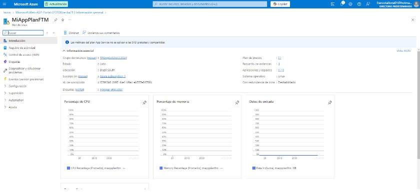
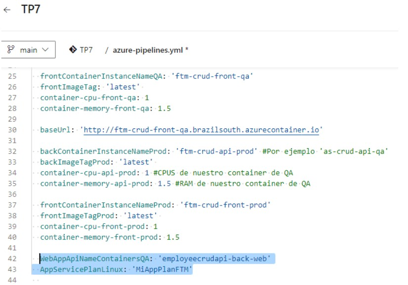
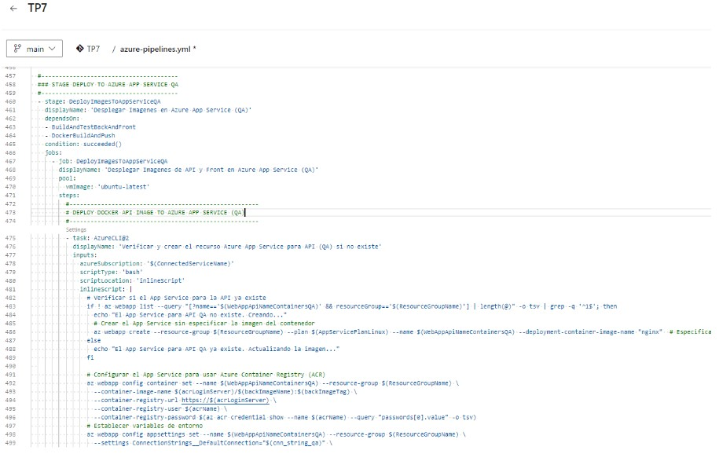
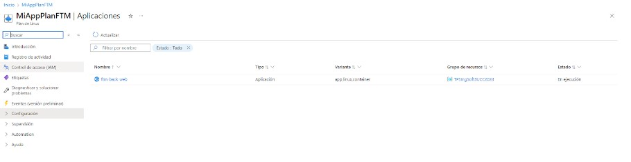
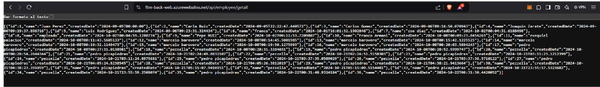


 4.2 Desafíos:
4.2.1 Agregar tareas para generar Front en Azure App Service con Soporte para Contenedores

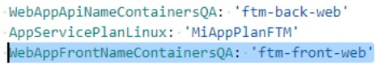
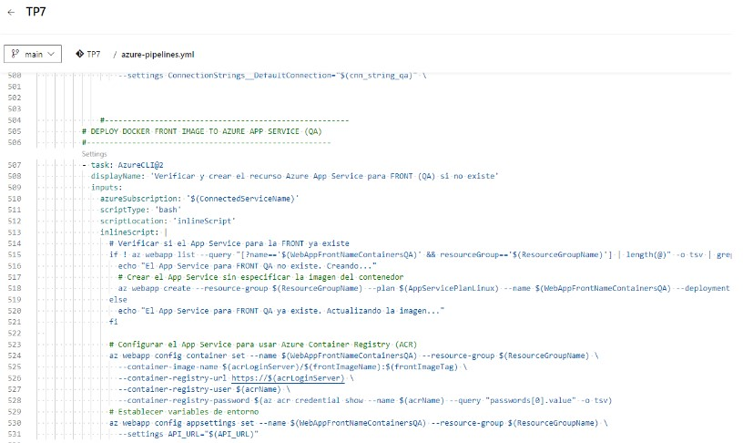
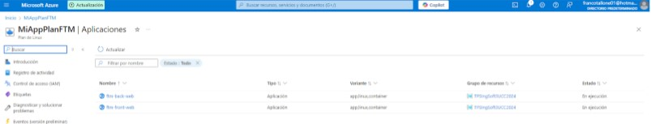
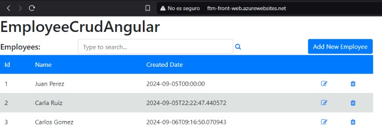


4.2.2 Agregar variables necesarias para el funcionamiento de la nueva etapa considerando que debe haber 2 entornos QA y PROD para Back y Front.

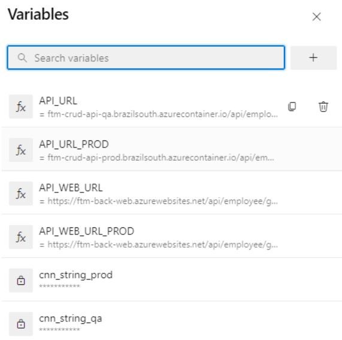

4.2.3 Agregar tareas para correr pruebas de integración en el entorno de QA de Back y Front creado en Azure App Services con Soporte para Contenedores.

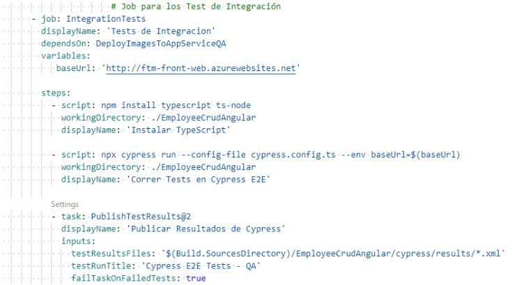
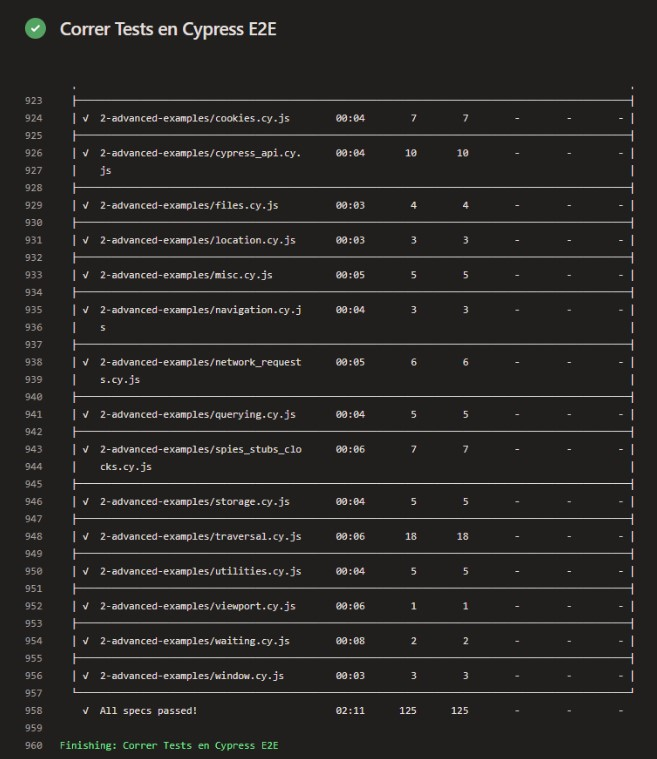


4.2.4 Agregar etapa que dependa de la etapa de Deploy en QA que genere un entorno de PROD.

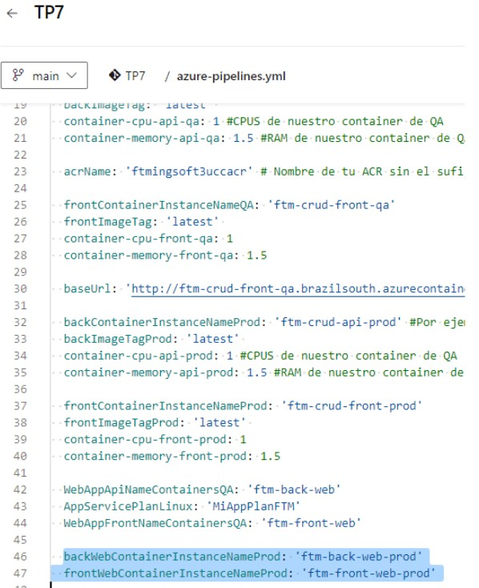
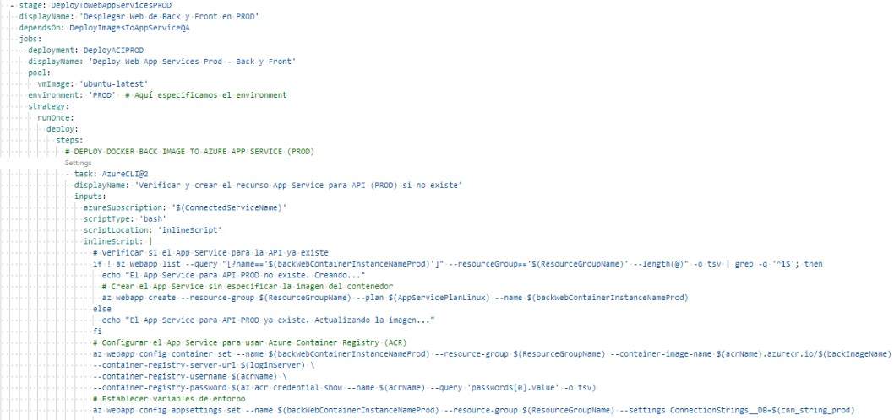
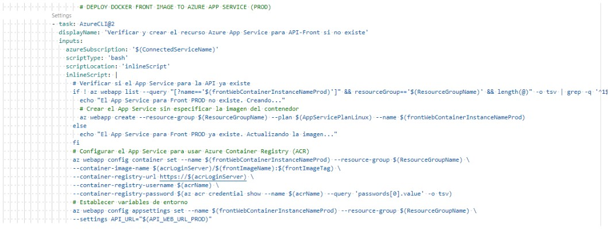
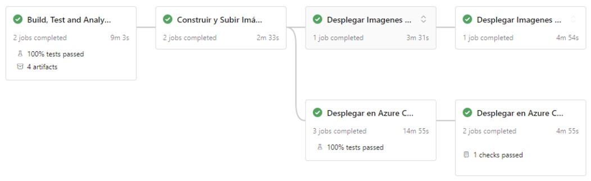
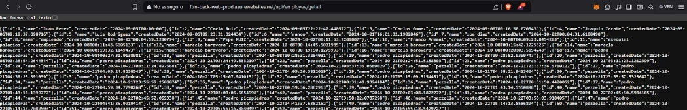
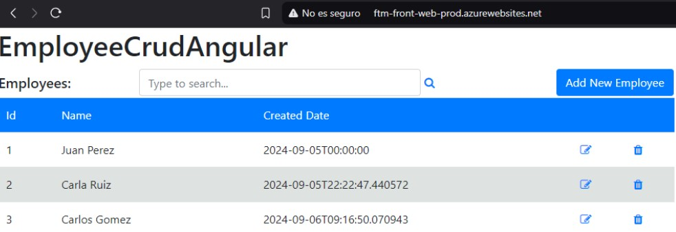


Agregamos aprobación manual:

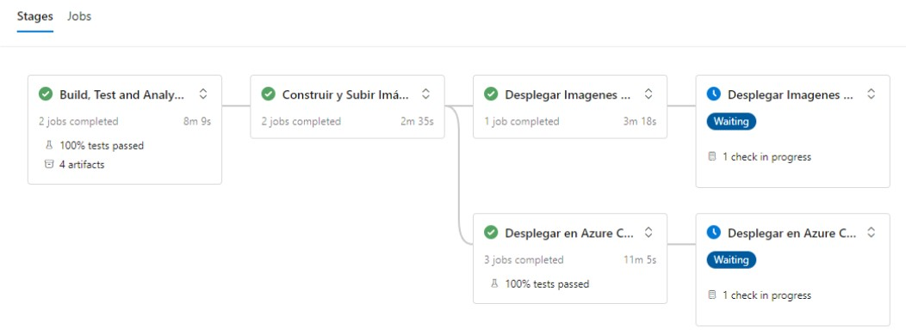
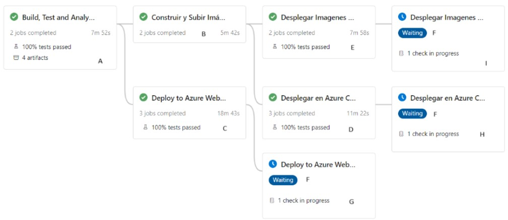


4.2.5 Entregar un pipeline que incluya:
A) Etapa Construcción y Pruebas Unitarias y Code Coverage Back y Front
B) Construcción de Imágenes Docker y subida a ACR
C) Deploy Back y Front en QA con pruebas de integración para Azure Web Apps
D) Deploy Back y Front en QA con pruebas de integración para ACI
E) Deploy Back y Front en QA con pruebas de integración para Azure Web Apps con Soporte para contenedores
F) Aprobación manual de QA para los puntos C,D,E
G) Deploy Back y Front en PROD para Azure Web Apps
H) Deploy Back y Front en PROD para ACI
I) Deploy Back y Front en PROD para Azure Web Apps con Soporte para contenedores

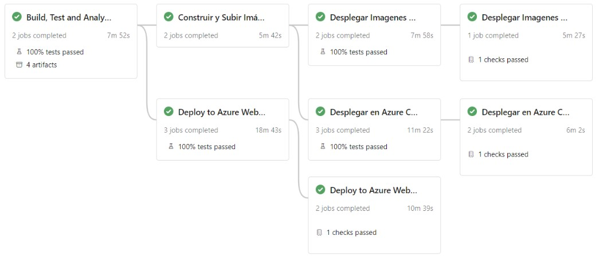
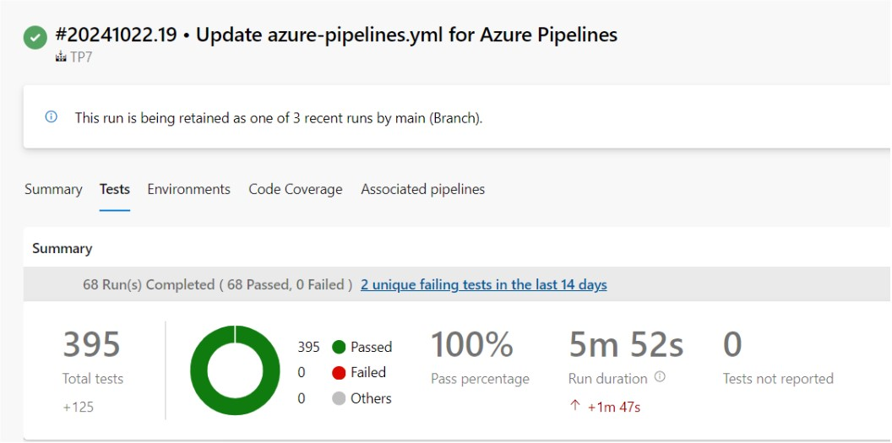
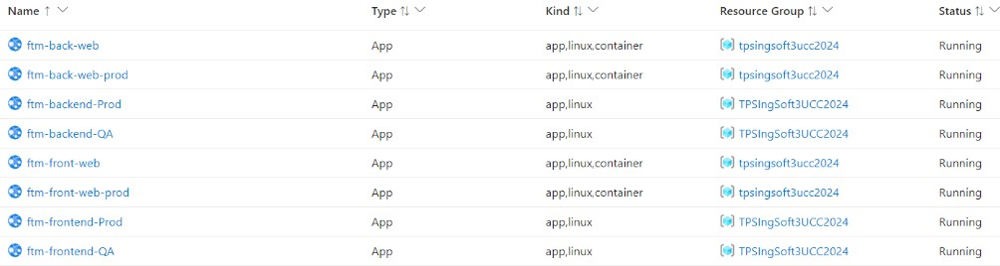


```yaml
trigger:
- main

pool:
  vmImage: 'windows-latest'

variables:
  solution: '**/*.sln'
  buildPlatform: 'Any CPU'
  buildConfiguration: 'Release'
  frontPath: './EmployeeCrudAngular'
  ConnectedServiceName: 'ServiceConnectionARM'
  acrLoginServer: 'ftmingsoft3uccacr.azurecr.io'
  backImageName: 'employee-crud-api'
  frontImageName: 'employee-crud-front'
  ResourceGroupName: 'TPSIngSoft3UCC2024' #Por ejemplo 'TPS_INGSOFT3_UCC'

  backContainerInstanceNameQA: 'ftm-crud-api-qa' #Por ejemplo 'as-crud-api-qa'
  backImageTag: 'latest' 
  container-cpu-api-qa: 1 #CPUS de nuestro container de QA
  container-memory-api-qa: 1.5 #RAM de nuestro container de QA

  acrName: 'ftmingsoft3uccacr' # Nombre de tu ACR sin el sufijo .azurecr.io

  frontContainerInstanceNameQA: 'ftm-crud-front-qa'
  frontImageTag: 'latest' 
  container-cpu-front-qa: 1
  container-memory-front-qa: 1.5

  baseUrl: 'http://ftm-crud-front-qa.brazilsouth.azurecontainer.io'

  backContainerInstanceNameProd: 'ftm-crud-api-prod' #Por ejemplo 'as-crud-api-qa'
  backImageTagProd: 'latest' 
  container-cpu-api-prod: 1 #CPUS de nuestro container de QA
  container-memory-api-prod: 1.5 #RAM de nuestro container de QA

  frontContainerInstanceNameProd: 'ftm-crud-front-prod'
  frontImageTagProd: 'latest' 
  container-cpu-front-prod: 1
  container-memory-front-prod: 1.5

  WebAppApiNameContainersQA: 'ftm-back-web'
  AppServicePlanLinux: 'MiAppPlanFTM'
  WebAppFrontNameContainersQA: 'ftm-front-web'

  backWebContainerInstanceNameProd: 'ftm-back-web-prod'
  frontWebContainerInstanceNameProd: 'ftm-front-web-prod'

  backWebAppNameQA: 'ftm-back-was-qa'
  frontWebAppNameQA: 'ftm-front-was-qa'

  # WEB APPS
  WebAppApiNameQA: 'ftm-backend-QA'
  api_url_wa_qa: 'https://$(WebAppApiNameQA).azurewebsites.net/api/Employee'

  WebAppFrontNameQA: 'ftm-frontend-QA'
  front_url_wa_qa: 'https://$(WebAppFrontNameQA).azurewebsites.net'

  WebAppApiNameProd: 'ftm-backend-Prod'
  api_url_wa_prod: 'https://$(WebAppApiNameProd).azurewebsites.net/api/Employee'

  WebAppFrontNameProd: 'ftm-frontend-Prod'
  front_url_wa_prod: 'https://$(WebAppFrontNameProd).azurewebsites.net'

 
  

stages:
  - stage: BuildAndTestBackAndFront
    displayName: 'Build, Test and Analyze API and Front'
    jobs:
      - job: BuildDotnet
        displayName: 'Build and Test API'
        pool:
          vmImage: 'windows-latest'
        steps:
          - checkout: self
            fetchDepth: 0


          # Instalar .NET 8 SDK
          - task: UseDotNet@2
            displayName: 'Instalar .NET 8.0 SDK'
            inputs:
              packageType: 'sdk'
              version: '8.x'
              installationPath: $(Agent.ToolsDirectory)/dotnet

          # Restaurar paquetes NuGet
          - task: DotNetCoreCLI@2
            displayName: 'Restaurar paquetes NuGet'
            inputs:
              command: restore
              projects: '$(solution)'

          # Ejecutar pruebas de la API
          - task: DotNetCoreCLI@2
            displayName: 'Ejecutar pruebas de la API'
            inputs:
              command: 'test'
              projects: '**/*.Tests.csproj'
              arguments: '--collect:"XPlat Code Coverage"'

          # Publicar resultados de code coverage del back-end
          - task: PublishCodeCoverageResults@2
            displayName: 'Publicar resultados de code coverage del back-end'
            inputs:
              summaryFileLocation: '$(Agent.TempDirectory)/**/*.cobertura.xml'
              failIfCoverageEmpty: false

          # Compilar la API
          - task: DotNetCoreCLI@2
            displayName: 'Compilar la API'
            inputs:
              command: build
              projects: '$(solution)'
              arguments: '--configuration $(buildConfiguration)'

          # Publicar aplicación .NET
          - task: DotNetCoreCLI@2
            displayName: 'Publicar aplicación'
            inputs:
              command: publish
              publishWebProjects: True
              arguments: '--configuration $(buildConfiguration) --output $(Build.ArtifactStagingDirectory)'
              zipAfterPublish: false

          # Publicar artefactos de compilación
          - task: PublishBuildArtifacts@1
            displayName: 'Publicar artefactos de compilación'
            inputs:
              PathtoPublish: '$(Build.ArtifactStagingDirectory)'
              ArtifactName: 'drop-back'
              publishLocation: 'Container'


          # Publicar Dockerfile de Back
          - task: PublishPipelineArtifact@1
            displayName: 'Publicar Dockerfile de Back'
            inputs:
              targetPath: '$(Build.SourcesDirectory)/docker/api/Dockerfile'
              artifact: 'dockerfile-back'

      - job: BuildAngular
        displayName: "Build and Test Angular"
        pool:
          vmImage: 'ubuntu-latest'
        steps:
          - checkout: self
            fetchDepth: 0

          # Instalar Node.js
          - task: NodeTool@0
            displayName: 'Instalar Node.js'
            inputs:
              versionSpec: '22.x'
    
          # Instalar dependencias
          - script: npm install
            displayName: 'Instalar dependencias'
            workingDirectory: $(frontPath)

          # Ejecutar pruebas del front con cobertura
          - script: npx ng test --karma-config=karma.conf.js --watch=false --browsers ChromeHeadless --code-coverage
            displayName: 'Ejecutar pruebas del front'
            workingDirectory: $(frontPath)
            continueOnError: true

          # Publicar resultados de code coverage del front
          - task: PublishCodeCoverageResults@2
            displayName: 'Publicar resultados de code coverage del front'
            inputs:
              summaryFileLocation: '$(frontPath)/coverage/lcov.info'
              failIfCoverageEmpty: false
            condition: always()

          # Publicar resultados de pruebas unitarias del front
          - task: PublishTestResults@2
            displayName: 'Publicar resultados de pruebas unitarias del front'
            inputs:
              testResultsFormat: 'JUnit'
              testResultsFiles: '$(frontPath)/test-results/test-results.xml'
              failTaskOnFailedTests: true
            condition: always()

          # Compilar el proyecto Angular
          - script: npm run build
            displayName: 'Compilar el proyecto Angular'
            workingDirectory: $(frontPath)

          # Publicar artefactos Angular
          - task: PublishBuildArtifacts@1
            displayName: 'Publicar artefactos Angular'
            inputs:
              PathtoPublish: '$(frontPath)/dist'
              ArtifactName: 'drop-front'

          # Publicar Dockerfile de Front
          - task: PublishPipelineArtifact@1
            displayName: 'Publicar Dockerfile de Front'
            inputs:
              targetPath: '$(Build.SourcesDirectory)/docker/front/Dockerfile'
              artifact: 'dockerfile-front'

#----------------------------------------------------------
  # ##  STAGE BUILD DOCKER IMAGES Y PUSH A AZURE CONTAINER REGISTRY
  #----------------------------------------------------------
  - stage: DockerBuildAndPush
    displayName: 'Construir y Subir Imágenes Docker a ACR'
    dependsOn: BuildAndTestBackAndFront
    jobs:
      - job: docker_build_and_push
        displayName: 'Construir y Subir Imágenes Docker a ACR'
        pool:
          vmImage: 'ubuntu-latest'
          
        steps:
          - checkout: self

          - task: DownloadPipelineArtifact@2
            displayName: 'Descargar Artefactos de Back'
            inputs:
              buildType: 'current'
              artifactName: 'drop-back'
              targetPath: '$(Pipeline.Workspace)/drop-back'
          
          - task: DownloadPipelineArtifact@2
            displayName: 'Descargar Dockerfile de Back'
            inputs:
              buildType: 'current'
              artifactName: 'dockerfile-back'
              targetPath: '$(Pipeline.Workspace)/dockerfile-back'

          - task: AzureCLI@2
            displayName: 'Iniciar Sesión en Azure Container Registry (ACR)'
            inputs:
              azureSubscription: '$(ConnectedServiceName)'
              scriptType: bash
              scriptLocation: inlineScript
              inlineScript: |
                az acr login --name $(acrLoginServer)
      
          - task: Docker@2
            displayName: 'Construir Imagen Docker para Back'
            inputs:
              command: build
              repository: $(acrLoginServer)/$(backImageName)
              dockerfile: $(Pipeline.Workspace)/dockerfile-back/Dockerfile
              buildContext: $(Pipeline.Workspace)/drop-back
              tags: 'latest'

          - task: Docker@2
            displayName: 'Subir Imagen Docker de Back a ACR'
            inputs:
              command: push
              repository: $(acrLoginServer)/$(backImageName)
              tags: 'latest'

      - job: docker_build_and_push_front
        displayName: 'Construir y Subir Imagen Docker de Front a ACR'
        pool:
          vmImage: 'ubuntu-latest'
          
        steps:
          - checkout: self

          - task: DownloadPipelineArtifact@2
            displayName: 'Descargar Artefactos de Front'
            inputs:
              buildType: 'current'
              artifactName: 'drop-front'
              targetPath: '$(Pipeline.Workspace)/drop-front'
          
          - task: DownloadPipelineArtifact@2
            displayName: 'Descargar Dockerfile de Front'
            inputs:
              buildType: 'current'
              artifactName: 'dockerfile-front'
              targetPath: '$(Pipeline.Workspace)/dockerfile-front'

          - task: AzureCLI@2
            displayName: 'Iniciar Sesión en Azure Container Registry (ACR)'
            inputs:
              azureSubscription: '$(ConnectedServiceName)'
              scriptType: bash
              scriptLocation: inlineScript
              inlineScript: |
                az acr login --name $(acrLoginServer)
      
          - task: Docker@2
            displayName: 'Construir Imagen Docker para Front'
            inputs:
              command: build
              repository: $(acrLoginServer)/$(frontImageName)
              dockerfile: $(Pipeline.Workspace)/dockerfile-front/Dockerfile
              buildContext: $(Pipeline.Workspace)/drop-front
              tags: 'latest'

          - task: Docker@2
            displayName: 'Subir Imagen Docker de Front a ACR'
            inputs:
              command: push
              repository: $(acrLoginServer)/$(frontImageName)
              tags: 'latest'

  # -------------------------------------------------------------------------------
  # |       STAGE DEPLOY FRONTEND AND BACKEND TO AZURE WEB APPS QA                 |
  # -------------------------------------------------------------------------------
  - stage: DeployToWebAppQA
    displayName: 'Deploy to Azure Web APPs (QA)'
    dependsOn: BuildAndTestBackAndFront
    condition: succeeded()
    pool:
      vmImage: 'windows-latest'
    
    jobs:
      # -------------------------------------------------------------------------------
      # |               DEPLOY API TO AZURE WEB APP                                    |
      # -------------------------------------------------------------------------------
      - job: DeployBackQA
        displayName: 'Deploy Backend to Azure Web APP (QA)'
        steps:
          - task: DownloadBuildArtifacts@1
            displayName: 'Download API artifacts'
            inputs:
              buildType: 'current'
              downloadType: 'single'
              artifactName: 'drop-back'  # Ensure 'drop-back' matches the published artifact name
              downloadPath: '$(System.ArtifactsDirectory)'
            
          - task: AzureCLI@2
            displayName: 'Crear App Service si no existe'
            inputs:
              azureSubscription: '$(ConnectedServiceName)'
              scriptType: bash
              scriptLocation: inlineScript
              inlineScript: |
                # Verifica si la App Service existe
                appExists=$(az webapp show --name $(WebAppApiNameQA) --resource-group $(ResourceGroupName) --query "name" --output tsv)
                if [ -z "$appExists" ]; then
                  echo "La App Service no existe. Creándola..."
                  az webapp create --resource-group $(ResourceGroupName) --plan $(AppServicePlanLinux) --name $(WebAppApiNameQA) --runtime "DOTNETCORE|6.0"
                else
                  echo "La App Service ya existe."
                fi


          - task: AzureRmWebAppDeployment@4
            displayName: 'Deploy API To Azure Web App'
            inputs:
              ConnectionType: 'AzureRM'
              azureSubscription: '$(ConnectedServiceName)'  # Make sure this variable is correctly set
              appType: 'webApp'
              WebAppName: $(WebAppApiNameQA)  # Variable for the API web app name
              packageForLinux: '$(System.ArtifactsDirectory)/drop-back/EmployeeCrudApi'
              AppSettings: '-DBCONNECTIONSTRING "$(cnn_string_qa)"'

      # -------------------------------------------------------------------------------
      # |               DEPLOY FRONT TO AZURE WEB APP                                 |
      # -------------------------------------------------------------------------------
      - job: DeployFrontQA
        displayName: 'Deploy Frontend to Azure Web APP (QA)'
        steps:
          - task: DownloadBuildArtifacts@1
            displayName: 'Download Frontend artifacts'
            inputs:
              buildType: 'current'
              downloadType: 'single'
              artifactName: 'drop-front'  # Ensure 'drop-front' matches the published artifact name
              downloadPath: '$(System.ArtifactsDirectory)'
          
          - task: AzureCLI@2
            displayName: 'Crear App Service si no existe'
            inputs:
              azureSubscription: '$(ConnectedServiceName)'
              scriptType: bash
              scriptLocation: inlineScript
              inlineScript: |
                # Verifica si la App Service existe
                appExists=$(az webapp show --name $(WebAppFrontNameQA) --resource-group $(ResourceGroupName) --query "name" --output tsv)
                if [ -z "$appExists" ]; then
                  echo "La App Service no existe. Creándola..."
                  az webapp create --resource-group $(ResourceGroupName) --plan $(AppServicePlanLinux) --name $(WebAppFrontNameQA) --runtime "DOTNETCORE|6.0"
                else
                  echo "La App Service ya existe."
                fi
          - script: |
              echo window['env'] = { apiUrl: '$(API_URL)' }; > $(System.ArtifactsDirectory)/drop-front/employee-crud-angular/browser/assets/env.js
            displayName: 'Set env.js content'
          
          - task: AzureRmWebAppDeployment@4
            displayName: 'Deploy Frontend To Azure Web App'
            inputs:
              ConnectionType: 'AzureRM'
              azureSubscription: '$(ConnectedServiceName)'  # Make sure this variable is correctly set
              appType: 'webApp'
              WebAppName: $(WebAppFrontNameQA)  # Variable for the frontend web app name
              packageForLinux: '$(System.ArtifactsDirectory)/drop-front/employee-crud-angular/browser'

  # -------------------------------------------------------------------------------
  # |              RUN INTEGRATION TESTS ON AZURE WEB APPS                         |
  # -------------------------------------------------------------------------------
      - job: RunCypressTests
        displayName: 'Run Cypress Tests on Web Apps'
        dependsOn: [DeployFrontQA, DeployBackQA]
        condition: succeeded()
        steps:
          - script: npm install ts-node typescript --save-dev
            displayName: 'Install typescript'
            workingDirectory: ./EmployeeCrudAngular

          - script: npx cypress run --config-file cypress.config.ts  --env baseUrl=$(baseUrl)
            workingDirectory: ./EmployeeCrudAngular
            displayName: 'Run integration tests'
            continueOnError: true
          
          - task: PublishTestResults@2
            inputs:
              testResultsFormat: 'JUnit'
              testResultsFiles: '*.xml'
              searchFolder: '$(frontPath)/cypress/results'
              testRunTitle: 'Cypress Integration Tests'

  # -------------------------------------------------------------------------------
  # |       STAGE DEPLOY FRONTEND AND BACKEND TO AZURE WEB APPS PROD               |
  # -------------------------------------------------------------------------------
  - stage: DeployToWebAppProd
    displayName: 'Deploy to Azure Web APPs (Prod)'
    dependsOn: DeployToWebAppQA
    condition: succeeded()
    pool:
      vmImage: 'windows-latest'
      
    jobs:
      # -------------------------------------------------------------------------------
      # |               DEPLOY API TO AZURE WEB APP                                    |
      # -------------------------------------------------------------------------------
      - deployment: DeployBack
        displayName: 'Deploy Backend to Azure Web APP (Prod)'
        environment: 'PROD'
        strategy:
          runOnce:
            deploy:
              steps:
                - task: DownloadBuildArtifacts@1
                  displayName: 'Download API artifacts'
                  inputs:
                    buildType: 'current'
                    downloadType: 'single'
                    artifactName: 'drop-back'  # Ensure 'drop-back' matches the published artifact name
                    downloadPath: '$(System.ArtifactsDirectory)'

                - task: AzureCLI@2
                  displayName: 'Crear App Service si no existe'
                  inputs:
                            azureSubscription: '$(ConnectedServiceName)'
                            scriptType: bash
                            scriptLocation: inlineScript
                            inlineScript: |
                              # Verifica si la App Service existe
                              appExists=$(az webapp show --name $(WebAppApiNameProd) --resource-group $(ResourceGroupName) --query "name" --output tsv)
                              if [ -z "$appExists" ]; then
                                echo "La App Service no existe. Creándola..."
                                az webapp create --resource-group $(ResourceGroupName) --plan $(AppServicePlanLinux) --name $(WebAppApiNameProd) --runtime "DOTNETCORE|6.0"
                              else
                                echo "La App Service ya existe."
                              fi


                - task: AzureRmWebAppDeployment@4
                  displayName: 'Deploy API To Azure Web App'
                  inputs:
                    ConnectionType: 'AzureRM'
                    azureSubscription: '$(ConnectedServiceName)'  # Make sure this variable is correctly set
                    appType: 'webApp'
                    WebAppName: $(WebAppApiNameProd)
                    packageForLinux: '$(System.ArtifactsDirectory)/drop-back/EmployeeCrudApi'
                    AppSettings: '-DBCONNECTIONSTRING "$(cnn_string_prod)"'

      # -------------------------------------------------------------------------------
      # |               DEPLOY FRONT TO AZURE WEB APP                                 |
      # -------------------------------------------------------------------------------
      - deployment: DeployFront
        displayName: 'Deploy Frontend to Azure Web APP (PROD)'
        environment: 'PROD'
        strategy:
          runOnce:
            deploy:
              steps:
                - task: DownloadBuildArtifacts@1
                  displayName: 'Download Frontend artifacts'
                  inputs:
                    buildType: 'current'
                    downloadType: 'single'
                    artifactName: 'drop-front'  # Ensure 'drop-front' matches the published artifact name
                    downloadPath: '$(System.ArtifactsDirectory)'
                
                - task: AzureCLI@2
                  displayName: 'Crear App Service si no existe'
                  inputs:
                            azureSubscription: '$(ConnectedServiceName)'
                            scriptType: bash
                            scriptLocation: inlineScript
                            inlineScript: |
                              # Verifica si la App Service existe
                              appExists=$(az webapp show --name $(WebAppFrontNameProd) --resource-group $(ResourceGroupName) --query "name" --output tsv)
                              if [ -z "$appExists" ]; then
                                echo "La App Service no existe. Creándola..."
                                az webapp create --resource-group $(ResourceGroupName) --plan $(AppServicePlanLinux) --name $(WebAppFrontNameProd) --runtime "DOTNETCORE|6.0"
                              else
                                echo "La App Service ya existe."
                              fi
               
                
                - script: |
                    echo window['env'] = { apiUrl: '$(api_url_wa_prod)' }; > $(System.ArtifactsDirectory)/drop-front/employee-crud-angular/browser/assets/env.js
                  displayName: 'Set env.js content'
                
                - task: AzureRmWebAppDeployment@4
                  displayName: 'Deploy Frontend To Azure Web App'
                  inputs:
                    ConnectionType: 'AzureRM'
                    azureSubscription: '$(ConnectedServiceName)'  # Make sure this variable is correctly set
                    appType: 'webApp'
                    WebAppName: $(WebAppFrontNameProd)
                    packageForLinux: '$(System.ArtifactsDirectory)/drop-front/employee-crud-angular/browser'
  #----------------------------------------------------------
  # ### STAGE DEPLOY TO ACI QA
  #----------------------------------------------------------
  - stage: DeployToACIQA
    displayName: 'Desplegar en Azure Container Instances (ACI) QA'
    dependsOn: DockerBuildAndPush 
    jobs:
      - job: deploy_to_aci_qa
        displayName: 'Desplegar en Azure Container Instances (ACI) QA'
        pool:
          vmImage: 'ubuntu-latest'
        steps:
      

        - task: AzureCLI@2
          displayName: 'Desplegar Imagen Docker de Back en ACI QA'
          inputs:
            azureSubscription: '$(ConnectedServiceName)'
            scriptType: bash
            scriptLocation: inlineScript
            inlineScript: |
              echo "Resource Group: $(ResourceGroupName)"
              echo "Container Instance Name: $(backContainerInstanceNameQA)"
              echo "ACR Login Server: $(acrLoginServer)"
              echo "Image Name: $(backImageName)"
              echo "Image Tag: $(backImageTag)"
              echo "Connection String: $(cnn_string_qa)"
          
              az container delete --resource-group $(ResourceGroupName) --name $(backContainerInstanceNameQA) --yes

              az container create --resource-group $(ResourceGroupName) \
                --name $(backContainerInstanceNameQA) \
                --image $(acrLoginServer)/$(backImageName):$(backImageTag) \
                --registry-login-server $(acrLoginServer) \
                --registry-username $(acrName) \
                --registry-password $(az acr credential show --name $(acrName) --query "passwords[0].value" -o tsv) \
                --dns-name-label $(backContainerInstanceNameQA) \
                --ports 80 \
                --environment-variables ConnectionStrings__DefaultConnection="$(cnn_string_qa)" \
                --restart-policy Always \
                --cpu $(container-cpu-api-qa) \
                --memory $(container-memory-api-qa)

      - job: deploy_front_to_aci_qa
        displayName: 'Desplegar Frontend en Azure Container Instances (ACI) QA'
        pool:
         vmImage: 'ubuntu-latest'
        
        steps:

        - task: AzureCLI@2
          displayName: 'Desplegar Imagen Docker de Front en ACI QA'
          inputs:
            azureSubscription: '$(ConnectedServiceName)'
            scriptType: bash
            scriptLocation: inlineScript
            inlineScript: |
              echo "Resource Group: $(ResourceGroupName)"
              echo "Container Instance Name: $(frontContainerInstanceNameQA)"
              echo "ACR Login Server: $(acrLoginServer)"
              echo "Image Name: $(frontImageName)"
              echo "Image Tag: $(frontImageTag)"
          
              az container delete --resource-group $(ResourceGroupName) --name $(frontContainerInstanceNameQA) --yes

              az container create --resource-group $(ResourceGroupName) \
                --name $(frontContainerInstanceNameQA) \
                --image $(acrLoginServer)/$(frontImageName):$(frontImageTag) \
                --registry-login-server $(acrLoginServer) \
                --registry-username $(acrName) \
                --registry-password $(az acr credential show --name $(acrName) --query "passwords[0].value" -o tsv) \
                --dns-name-label $(frontContainerInstanceNameQA) \
                --ports 80 \
                --environment-variables API_URL="$(API_URL)" \
                --restart-policy Always \
                --cpu $(container-cpu-front-qa) \
                --memory $(container-memory-front-qa)

      - job: RunCypressTests
        displayName: 'Run Cypress Tests'
        dependsOn: [deploy_front_to_aci_qa, deploy_to_aci_qa]
        condition: succeeded()
        
        steps:
        - script: npm install typescript ts-node
          workingDirectory: ./EmployeeCrudAngular
          displayName: 'Instalar TypeScript'
        - script: npx cypress run --config-file cypress.config.ts --env baseUrl=$(baseUrl)
          workingDirectory: ./EmployeeCrudAngular
          displayName: 'Correr Tests en Cypress E2E'

        - task: PublishTestResults@2
          displayName: 'Publicar Resultados de Cypress'
          inputs:
            testResultsFiles: '$(Build.SourcesDirectory)/EmployeeCrudAngular/cypress/results/*.xml'
            testRunTitle: 'Cypress E2E Tests - QA'
            failTaskOnFailedTests: true


  - stage: DeployToACIProd
    displayName: 'Desplegar en Azure Container Instances (ACI) PROD'
    dependsOn: DeployToACIQA 
    jobs:
    - deployment: deploy_to_aci_PROD
      displayName: 'Desplegar en Azure Container Instances (ACI) PROD'
      environment: 'PROD'  # Colocar 'environment' aquí
      strategy:
        runOnce:
          deploy:
            steps:
              - task: AzureCLI@2
                displayName: 'Desplegar Imagen Docker de Back en ACI PROD'
                inputs:
                  azureSubscription: '$(ConnectedServiceName)'
                  scriptType: bash
                  scriptLocation: inlineScript
                  inlineScript: |
                    echo "Resource Group: $(ResourceGroupName)"
                    echo "Container Instance Name: $(backContainerInstanceNameProd)"
                    echo "ACR Login Server: $(acrLoginServer)"
                    echo "Image Name: $(backImageName)"
                    echo "Image Tag: $(backImageTagProd)"
                    echo "Connection String: $(cnn_string_prod)"
                    
                    az container delete --resource-group $(ResourceGroupName) --name $(backContainerInstanceNameProd) --yes

                    az container create --resource-group $(ResourceGroupName) \
                      --name $(backContainerInstanceNameProd) \
                      --image $(acrLoginServer)/$(backImageName):$(backImageTagProd) \
                      --registry-login-server $(acrLoginServer) \
                      --registry-username $(acrName) \
                      --registry-password $(az acr credential show --name $(acrName) --query "passwords[0].value" -o tsv) \
                      --dns-name-label $(backContainerInstanceNameProd) \
                      --ports 80 \
                      --environment-variables ConnectionStrings__DefaultConnection="$(cnn_string_prod)" \
                      --restart-policy Always \
                      --cpu $(container-cpu-api-prod) \
                      --memory $(container-memory-api-prod)

    - deployment: deploy_front_to_aci_prod
      displayName: 'Desplegar Frontend en Azure Container Instances (ACI) PROD'
      environment: 'PROD'  # Colocar 'environment' aquí
      strategy:
        runOnce:
          deploy:
            steps:
              - task: AzureCLI@2
                displayName: 'Desplegar Imagen Docker de Front en ACI PROD'
                inputs:
                  azureSubscription: '$(ConnectedServiceName)'
                  scriptType: bash
                  scriptLocation: inlineScript
                  inlineScript: |
                    echo "Resource Group: $(ResourceGroupName)"
                    echo "Container Instance Name: $(frontContainerInstanceNameProd)"
                    echo "ACR Login Server: $(acrLoginServer)"
                    echo "Image Name: $(frontImageName)"
                    echo "Image Tag: $(frontImageTagProd)"
                    
                    az container delete --resource-group $(ResourceGroupName) --name $(frontContainerInstanceNameProd) --yes

                    az container create --resource-group $(ResourceGroupName) \
                      --name $(frontContainerInstanceNameProd) \
                      --image $(acrLoginServer)/$(frontImageName):$(frontImageTagProd) \
                      --registry-login-server $(acrLoginServer) \
                      --registry-username $(acrName) \
                      --registry-password $(az acr credential show --name $(acrName) --query "passwords[0].value" -o tsv) \
                      --dns-name-label $(frontContainerInstanceNameProd) \
                      --ports 80 \
                      --environment-variables API_URL="$(API_URL_PROD)" \
                      --restart-policy Always \
                      --cpu $(container-cpu-front-prod) \
                      --memory $(container-memory-front-prod)

  #---------------------------------------
  ### STAGE DEPLOY TO AZURE APP SERVICE QA
  #---------------------------------------
  - stage: DeployImagesToAppServiceQA
    displayName: 'Desplegar Imagenes en Azure App Service (QA)'
    dependsOn: 
    - BuildAndTestBackAndFront
    - DockerBuildAndPush
    condition: succeeded()
    jobs:
      - job: DeployImagesToAppServiceQA
        displayName: 'Desplegar Imagenes de API y Front en Azure App Service (QA)'
        pool:
          vmImage: 'ubuntu-latest'
        steps:
          #------------------------------------------------------
          # DEPLOY DOCKER API IMAGE TO AZURE APP SERVICE (QA)
          #------------------------------------------------------
          - task: AzureCLI@2
            displayName: 'Verificar y crear el recurso Azure App Service para API (QA) si no existe'
            inputs:
              azureSubscription: '$(ConnectedServiceName)'
              scriptType: 'bash'
              scriptLocation: 'inlineScript'
              inlineScript: |
                # Verificar si el App Service para la API ya existe
                if ! az webapp list --query "[?name=='$(WebAppApiNameContainersQA)' && resourceGroup=='$(ResourceGroupName)'] | length(@)" -o tsv | grep -q '^1$'; then
                  echo "El App Service para API QA no existe. Creando..."
                  # Crear el App Service sin especificar la imagen del contenedor
                  az webapp create --resource-group $(ResourceGroupName) --plan $(AppServicePlanLinux) --name $(WebAppApiNameContainersQA) --deployment-container-image-name "nginx"  # Especifica una imagen temporal para permitir la creación
                else
                  echo "El App Service para API QA ya existe. Actualizando la imagen..."
                fi
  
                # Configurar el App Service para usar Azure Container Registry (ACR)
                az webapp config container set --name $(WebAppApiNameContainersQA) --resource-group $(ResourceGroupName) \
                  --container-image-name $(acrLoginServer)/$(backImageName):$(backImageTag) \
                  --container-registry-url https://$(acrLoginServer) \
                  --container-registry-user $(acrName) \
                  --container-registry-password $(az acr credential show --name $(acrName) --query "passwords[0].value" -o tsv)
                # Establecer variables de entorno
                az webapp config appsettings set --name $(WebAppApiNameContainersQA) --resource-group $(ResourceGroupName) \
                  --settings ConnectionStrings__DefaultConnection="$(cnn_string_qa)" \


              #------------------------------------------------------
          # DEPLOY DOCKER FRONT IMAGE TO AZURE APP SERVICE (QA)
          #------------------------------------------------------
          - task: AzureCLI@2
            displayName: 'Verificar y crear el recurso Azure App Service para FRONT (QA) si no existe'
            inputs:
              azureSubscription: '$(ConnectedServiceName)'
              scriptType: 'bash'
              scriptLocation: 'inlineScript'
              inlineScript: |
                # Verificar si el App Service para la FRONT ya existe
                if ! az webapp list --query "[?name=='$(WebAppFrontNameContainersQA)' && resourceGroup=='$(ResourceGroupName)'] | length(@)" -o tsv | grep -q '^1$'; then
                  echo "El App Service para FRONT QA no existe. Creando..."
                  # Crear el App Service sin especificar la imagen del contenedor
                  az webapp create --resource-group $(ResourceGroupName) --plan $(AppServicePlanLinux) --name $(WebAppFrontNameContainersQA) --deployment-container-image-name "nginx"  # Especifica una imagen temporal para permitir la creación
                else
                  echo "El App Service para FRONT QA ya existe. Actualizando la imagen..."
                fi
  
                # Configurar el App Service para usar Azure Container Registry (ACR)
                az webapp config container set --name $(WebAppFrontNameContainersQA) --resource-group $(ResourceGroupName) \
                  --container-image-name $(acrLoginServer)/$(frontImageName):$(frontImageTag) \
                  --container-registry-url https://$(acrLoginServer) \
                  --container-registry-user $(acrName) \
                  --container-registry-password $(az acr credential show --name $(acrName) --query "passwords[0].value" -o tsv)
                # Establecer variables de entorno
                az webapp config appsettings set --name $(WebAppFrontNameContainersQA) --resource-group $(ResourceGroupName) \
                  --settings API_URL="$(API_URL)"

                      # Job para los Test de Integración
      - job: IntegrationTests
        displayName: 'Tests de Integracion'
        dependsOn: DeployImagesToAppServiceQA
        variables:
           baseUrl: 'http://ftm-front-web.azurewebsites.net'

        steps:
          - script: npm install typescript ts-node
            workingDirectory: ./EmployeeCrudAngular
            displayName: 'Instalar TypeScript'

          - script: npx cypress run --config-file cypress.config.ts --env baseUrl=$(baseUrl)
            workingDirectory: ./EmployeeCrudAngular
            displayName: 'Correr Tests en Cypress E2E'

          - task: PublishTestResults@2
            displayName: 'Publicar Resultados de Cypress'
            inputs:
              testResultsFiles: '$(Build.SourcesDirectory)/EmployeeCrudAngular/cypress/results/*.xml'
              testRunTitle: 'Cypress E2E Tests - QA'
              failTaskOnFailedTests: true


  #---------------------------------------
  ### STAGE DEPLOY TO AZURE APP SERVICE PROD
  #---------------------------------------
  - stage: DeployImagesToAppServicePROD
    displayName: 'Desplegar Imagenes en Azure App Service PROD'
    dependsOn: DeployImagesToAppServiceQA
    condition: succeeded()
    jobs:
      - deployment: DeployImagesToAppServicePROD
        displayName: 'Desplegar Imagenes de API y Front en Azure App Service PROD'
        environment: 'PROD'  # Se añade el environment para activar la aprobación manual
        strategy:
          runOnce:
            deploy:
              steps:
                #------------------------------------------------------
                # DEPLOY DOCKER API IMAGE TO AZURE APP SERVICE PROD
                #------------------------------------------------------
                - task: AzureCLI@2
                  displayName: 'Verificar y crear el recurso Azure App Service para API PROD si no existe'
                  inputs:
                    azureSubscription: '$(ConnectedServiceName)'
                    scriptType: 'bash'
                    scriptLocation: 'inlineScript'
                    inlineScript: |
                      # Verificar si el App Service para la API ya existe
                      if ! az webapp list --query "[?name=='$(backWebContainerInstanceNameProd)' && resourceGroup=='$(ResourceGroupName)'] | length(@)" -o tsv | grep -q '^1$'; then
                        echo "El App Service para API PROD no existe. Creando..."
                        # Crear el App Service sin especificar la imagen del contenedor
                        az webapp create --resource-group $(ResourceGroupName) --plan $(AppServicePlanLinux) --name $(backWebContainerInstanceNameProd) --deployment-container-image-name "nginx"  # Especifica una imagen temporal para permitir la creación
                      else
                        echo "El App Service para API PROD ya existe. Actualizando la imagen..."
                      fi
    
                      # Configurar el App Service para usar Azure Container Registry (ACR)
                      az webapp config container set --name $(backWebContainerInstanceNameProd) --resource-group $(ResourceGroupName) \
                        --container-image-name $(acrLoginServer)/$(backImageName):$(backImageTag) \
                        --container-registry-url https://$(acrLoginServer) \
                        --container-registry-user $(acrName) \
                        --container-registry-password $(az acr credential show --name $(acrName) --query "passwords[0].value" -o tsv)
                      # Establecer variables de entorno
                      az webapp config appsettings set --name $(backWebContainerInstanceNameProd) --resource-group $(ResourceGroupName) \
                        --settings ConnectionStrings__DefaultConnection="$(cnn_string_prod)" \
    
                #------------------------------------------------------
                # DEPLOY DOCKER FRONT IMAGE TO AZURE APP SERVICE PROD
                #------------------------------------------------------
                - task: AzureCLI@2
                  displayName: 'Verificar y crear el recurso Azure App Service para FRONT PROD si no existe'
                  inputs:
                    azureSubscription: '$(ConnectedServiceName)'
                    scriptType: 'bash'
                    scriptLocation: 'inlineScript'
                    inlineScript: |
                      # Verificar si el App Service para la FRONT PROD ya existe
                      if ! az webapp list --query "[?name=='$(frontWebContainerInstanceNameProd)' && resourceGroup=='$(ResourceGroupName)'] | length(@)" -o tsv | grep -q '^1$'; then
                        echo "El App Service para FRONT PROD no existe. Creando..."
                        # Crear el App Service sin especificar la imagen del contenedor
                        az webapp create --resource-group $(ResourceGroupName) --plan $(AppServicePlanLinux) --name $(frontWebContainerInstanceNameProd) --deployment-container-image-name "nginx"  # Especifica una imagen temporal para permitir la creación
                      else
                        echo "El App Service para FRONT PROD ya existe. Actualizando la imagen..."
                      fi
    
                      # Configurar el App Service para usar Azure Container Registry (ACR)
                      az webapp config container set --name $(frontWebContainerInstanceNameProd) --resource-group $(ResourceGroupName) \
                        --container-image-name $(acrLoginServer)/$(frontImageName):$(frontImageTag) \
                        --container-registry-url https://$(acrLoginServer) \
                        --container-registry-user $(acrName) \
                        --container-registry-password $(az acr credential show --name $(acrName) --query "passwords[0].value" -o tsv)
                      # Establecer variables de entorno
                      az webapp config appsettings set --name $(frontWebContainerInstanceNameProd) --resource-group $(ResourceGroupName) \
                        --settings API_URL="$(API_WEB_URL_PROD)"


```


